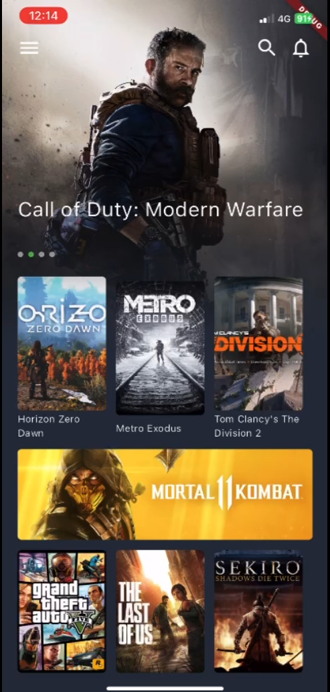

# 🎮 Gamify App

Gamify App is a Flutter-based mobile application that mimics the user experience of a modern streaming or gaming platform. The app is designed to showcase a sleek and intuitive UI/UX, allowing users to explore, interact, and immerse themselves in a gamified digital environment.



## ✨ Features

- 🎨 **Modern UI/UX** inspired by popular streaming and game content platforms.
- 🧩 Modular Flutter architecture, ready for expansion and new features.
- 📱 Fully responsive and optimized for mobile devices.
- 🌙 Dark mode interface for a smooth visual experience.

## 🚀 Getting Started

To run the app locally:

1. **Clone the repo:**
   ```bash
   git clone https://github.com/azlancpool/gamify_app.git
   cd gamify_app

2. **Install dependencies:**
   ```bash
   flutter pub get

3. **Run the app:**
   ```bash
   flutter run

## 🛠️ Tech Stack
- Flutter: UI toolkit for building cross-platform apps
- Dart: Programming language used with Flutter
- Custom UI: Manually designed components for full control over look & feel


## 🤝 Contributions
Contributions, ideas, and suggestions are welcome! Please feel free to open an issue or submit a pull request.

## 📄 License
This project is licensed under the MIT License. See the [LICENSE](LICENSE) file for more details.
